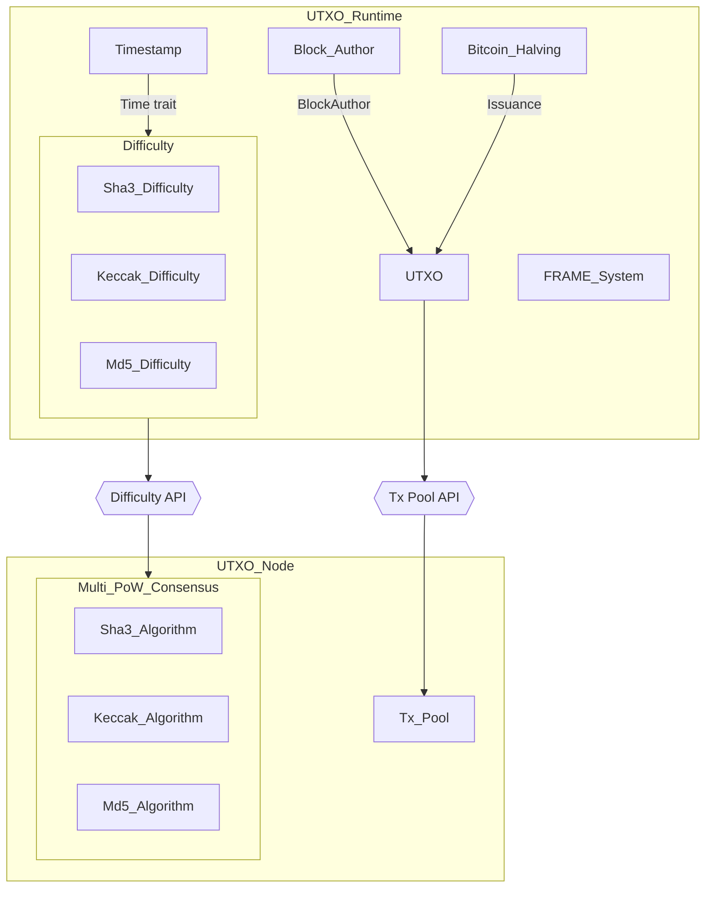

# Substrate Bitcoin-like Blockchain with UTXO account model

## Academy-PoW

This repository is generated from [Academy-PoW](https://github.com/Polkadot-Blockchain-Academy/Academy-PoW) repository. 


However, during implement Bitcoin-like blockchain, I've to update and fix a lot to make sure to code run smoothly.


Significantly, I've bumped Polkadot-SDK to stable-2407. That's quite complected but I've made it thanks to comprehensive document of OpenGuild's Polkadot SDK course.
- [Bump Polkadot SDK versions lesson doc.](https://bootcamp.openguild.wtf/building-a-blockchain-with-polkadot-sdk/polkadot-sdk/substrate/bump-polkadot-sdk-versions)
- [Bump Polkadot SDK versions lesson video.](https://www.youtube.com/watch?v=6nhIZmE1Nck&list=PLnhzaKpksqOKiqu9DDjGnmZWB0hYTaOUC&index=15)
- My commit: [be5c66](https://github.com/danielbui12/substrate-bitcoin-like-blockchain/commit/be5c665779dc23e2ac2c710ce5ada95975b4d5d2)

## Substrate UTXO Workshop

This version builds upon the work of giants from [Building a UTXO Chain from Scratch | Substrate Seminar](https://www.youtube.com/watch?v=XuJmxMMHvDw), with even more inspiration (I believe! 😃).

## Proof of Work

- Discover [Proof-of-Work (PoW)](docs/pow/pow.md)
- Understanding overview of PoW in Substrate by reading [code breakdown](docs/pow/code-breakdown.md).


## UTXO

- Discover [What is UTXO account model?](docs/utxo/utxo.md)
- Understanding overview of UTXO in Substrate by reading [code breakdown](docs/utxo/code-breakdown.md).


## Prerequisites

Before proceeding with this interactive tutorial, make sure you complete the initial tutorials on Substrate development from the official documentation. If you haven't gone through them yet, please review them first to build a solid foundation.

- [Substrate develop environment: Select your environment and complete `Install required packages and Rust`)](https://docs.substrate.io/install/)
- [Substrate Tutorial](https://polkadot.study/tutorials/interactive-substrate-tutorials-rusty-crewmates/)
- [Polkadot SDK doc](https://paritytech.github.io/polkadot-sdk/master/polkadot_sdk_docs/polkadot_sdk/index.html)
- [Substrate simulate a network](https://docs.substrate.io/tutorials/build-a-blockchain/simulate-network/)

Overview of Bitcoin-like Blockchain in Substrate



## How to run the node

- Refer to [How to run the node](docs/how-to-run-the-node.md) to choose development environment and boost up your first local blockchain node.

## Demo usage

- Please follow exactly these [instructions](docs/demo-usage.md) to get best experience.


## Build your own UTXO account model

Let's build your own Bitcoin-like blockchain with UTXO account model.

```sh
git checkout step-1-setup
cargo build --release
```

Then follow branches `step-*` to complete this tutorial.

| Step | Status | Modules                                                                                            | Description                                                                                     |
| ---- | ------ | -------------------------------------------------------------------------------------------------- | ----------------------------------------------------------------------------------------------- |
| #0   | ✅     | Prerequisites                                                                                      | Prepare your local environment to work with Substrate node and the code template. |
| #1   | ✅     | [step-1-setup](https://github.com/danielbui12/substrate-bitcoin-like-blockchain/tree/step-1-setup) | Clone `substrate-bitcoin-like-blockchain` and checkout branch `step-1-setup` to setup the template code on the local. |
| #2   | ✅     | [step-2-data-structure](https://github.com/danielbui12/substrate-bitcoin-like-blockchain/tree/step-2-data-structure) | Learn about Pallet storage, event & error, coupling. Then write basic data structures for UTXO account model. |
| #3   | ✅     | [step-3-spend-utxo](https://github.com/danielbui12/substrate-bitcoin-like-blockchain/tree/step-3-spend-utxo) | Learn about dispatchable functions, and write an extrinsic to allow accounts to transfer their tokens. |
| #4   | ✅     | [step-4-dispersed-reward](https://github.com/danielbui12/substrate-bitcoin-like-blockchain/tree/step-4-dispersed-reward) | Learn about pallet hook and pallet lifecycle, event and write method to mutate storage. |
| #5   | ✅     | [step-5-runtime](https://github.com/danielbui12/substrate-bitcoin-like-blockchain/tree/step-5-runtime) | Understanding Substrate runtime & transition pool. Override validate transaction to allow UTXO transactions. |
| #6   | ✅     | [step-6-genesis-builder](https://github.com/danielbui12/substrate-bitcoin-like-blockchain/tree/step-6-genesis-builder) | Learn & implement genesis config & genesis builder for pallet UTXO. |
| #7   | ✅     | [step-7-warp-up](https://github.com/danielbui12/substrate-bitcoin-like-blockchain/tree/step-7-warp-up) |  |


## FAQ

- Read the [Frequently Asked Questions - FAQ](docs/faq.md)