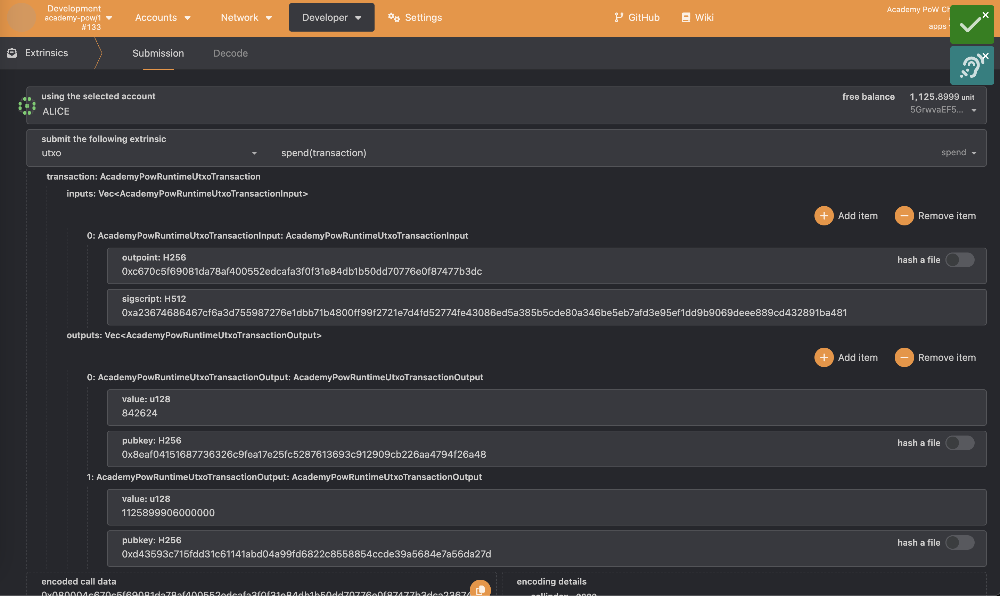
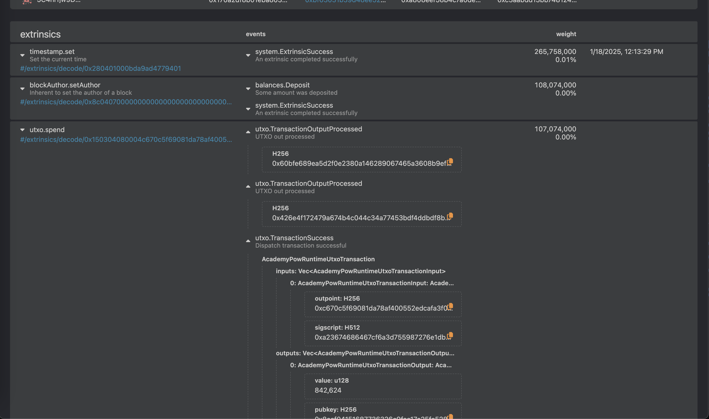
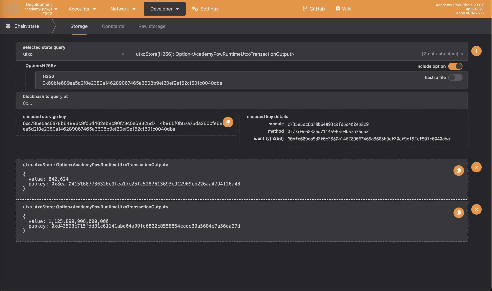

# Demo usage

## Address

- Powerful tool to convert `SS58 account` to `sr25519::Pubkey`: https://polkadot.subscan.io/tools/format_transform
- Alice: from `5GrwvaEF5zXb26Fz9rcQpDWS57CtERHpNehXCPcNoHGKutQY` to `0xd43593c715fdd31c61141abd04a99fd6822c8558854ccde39a5684e7a56da27d`
- Bob: from `5FHneW46xGXgs5mUiveU4sbTyGBzmstUspZC92UhjJM694ty` to `0x8eaf04151687736326c9fea17e25fc5287613693c912909cb226aa4794f26a48` 

## Scenario

1. Initially, Alice has UTXO $100.
2. She transfers to BOB an UTXO $50, but she doesn't have an UTXO $50. So she has to use her $100.
3. `TransactionInput` contains `outpoint` is UTXO $100, `sigscript` is signed data of "simple transaction" (refer to `runtime/src/utxo.rs:354`).
5. There will be 2 `TransactionOutput`s:
    - `TransactionOutput` contains `value` is UTXO $50, `pubkey` is Bob address
    - `TransactionOutput` contains `value` is UTXO $50, `pubkey` is Alice address

## Steps

- Navigate to: https://polkadot.js.org/apps/?rpc=ws%3A%2F%2F127.0.0.1%3A9944#/extrinsics

### 1. Alice faucets UTXO 100

- Select `utxo`, `faucet`

**Input**
- `to`: 0xd43593c715fdd31c61141abd04a99fd6822c8558854ccde39a5684e7a56da27d 
- `amount`: 100

Then submit signed transaction

**Event**

- `hash`: 0xdc25c09de55abb8ea4c3d53bd1ca5c26e0501db8cede096d8328cb482fda935a

**Check balance**

- Switch to [_Chain State_](https://polkadot.js.org/apps/?rpc=ws%3A%2F%2F127.0.0.1%3A9944#/chainstate), select `utxo`, `utxoStore`
- Input: `0xdc25c09de55abb8ea4c3d53bd1ca5c26e0501db8cede096d8328cb482fda935a`
- Press **+** button
- Verify Alice has UTXO 100

### 2. Alice transfers UTXO 50 to Bob, get back UXTO 50

**Input**

- `inputs[0].outpoint`: 0xdc25c09de55abb8ea4c3d53bd1ca5c26e0501db8cede096d8328cb482fda935a
- `inputs[0].sigscript`: 0xa477ed0c2b6014f83259ad2adca605ca2d47fa1fc694f30d87e6fb06482df72c2473bec6627c49904d31ede63c1c4d8d059a94ebb41cd881e3bf98dcc1797084

- `outputs[0].value`: 50
- `outputs[0].pubkey`: 0x8eaf04151687736326c9fea17e25fc5287613693c912909cb226aa4794f26a48
- `outputs[1].value`: 50
- `outputs[1].pubkey`: 0xd43593c715fdd31c61141abd04a99fd6822c8558854ccde39a5684e7a56da27d

Then submit unsigned transaction

**Events**

- hash of Bob: 0xe292131bbf25a3131045f26c2b750e6e7d26fc56a473aaf19e3a60d15ca3a82f
- hash of Alice: 0x7108d560f7d0079c8fe711f0ff5d316438cd376911e176b8bab62327e5ff8f0a

**Check balance**

- Switch to [_Chain State_](https://polkadot.js.org/apps/?rpc=ws%3A%2F%2F127.0.0.1%3A9944#/chainstate), select `utxo`, `utxoStore`

Alice: 
- Input: `0x7108d560f7d0079c8fe711f0ff5d316438cd376911e176b8bab62327e5ff8f0a`
- Press **+** button
- Verify Alice has an UTXO $50

Bob:
- Input: `0xe292131bbf25a3131045f26c2b750e6e7d26fc56a473aaf19e3a60d15ca3a82f`
- Press **+** button
- Verify Bob has an UTXO $50

## 3. Another way to check the Account balance

- Head over to [_Chain State_](https://polkadot.js.org/apps/?rpc=ws%3A%2F%2F127.0.0.1%3A9944#/chainstate), select `utxo`, `utxoOf`
- Input sr25519::Pubkey of Alice or Bob, refer to [this](#Address)
- Then you'll get the latest UTXO hash of them, now you can easily keep track the balance of accounts.

### Custom your own

> [!NOTE]
> If you would love to play in your own way, refer to `scripts/generate-signature/generate-signature.js` to generate your own custom signed data!