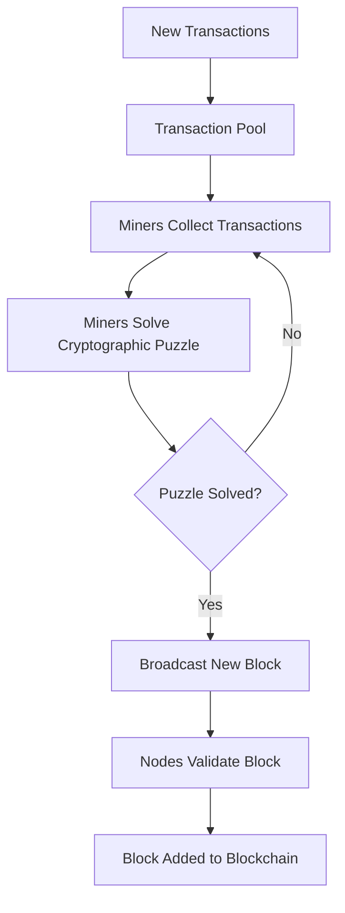
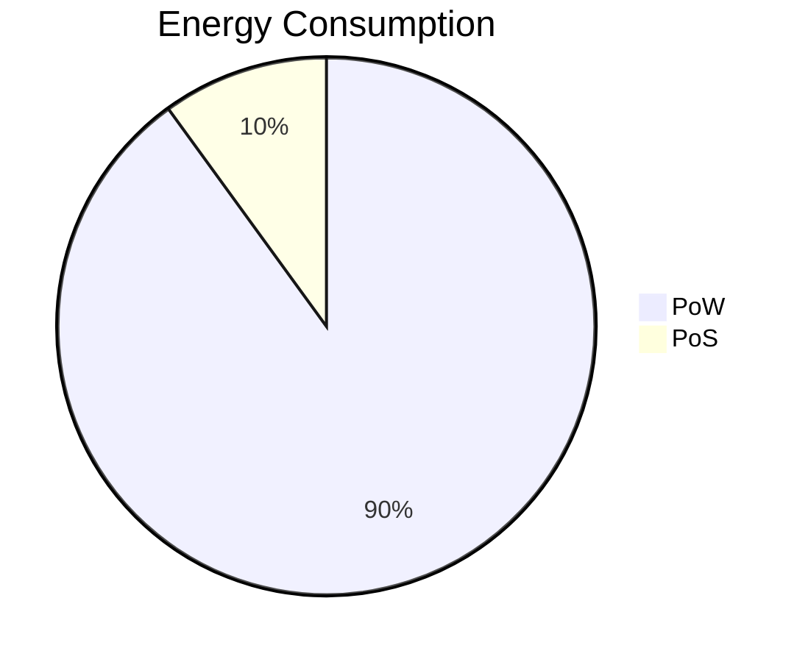

# Understanding Proof-of-Work (PoW)

## What is PoW

Proof-of-Work (PoW) is a consensus mechanism used in blockchain networks to achieve agreement among distributed nodes. It requires participants, often called miners, to perform computational work to validate transactions and add them to the blockchain. PoW was first introduced in Bitcoin and has become a foundational element in the blockchain ecosystem.

### Key Features of PoW

- **Decentralization**: Ensures no central authority controls the network.
- **Security**: Prevents malicious actors from easily taking over the network.
- **Incentives**: Rewards participants with newly minted cryptocurrency and transaction fees.

## Understanding Consensus

Consensus refers to the process by which blockchain participants agree on the validity of transactions and the state of the ledger. In a decentralized network, consensus mechanisms are essential to ensure the integrity of the blockchain without relying on a trusted third party.

### Characteristics of a Consensus Mechanism

- **Fault Tolerance**: The ability to handle malicious or faulty nodes.
- **Scalability**: Supporting a growing number of participants and transactions.
- **Energy Efficiency**: Minimizing resource consumption.

## How PoW Works

In a PoW-based system, miners compete to solve a cryptographic puzzle. The first miner to solve the puzzle gets the right to add a new block to the blockchain and receives a reward. Here is a step-by-step breakdown:

### Details of the Process

1. **Transaction Pool**: Transactions are collected into a pool awaiting validation.
2. **Cryptographic Puzzle**: Miners solve a complex mathematical problem based on the block's content.
3. **Validation**: Once solved, the solution is broadcast to the network for verification.
4. **Block Addition**: Upon consensus, the block is added to the chain, and the miner is rewarded.

### 51% Attack

A significant vulnerability in PoW systems is the possibility of a **51% attack**. This occurs when a single miner or group of miners gains control of more than 50% of the network's computational power. With such dominance, they could:

- **Double-spend coins**: Reverse transactions they previously made.
- **Block transactions**: Prevent new transactions from being confirmed.
- **Disrupt the network**: Cause general instability and undermine trust.

While a 51% attack is theoretically possible, executing it on large, well-established networks like Bitcoin is extremely difficult due to the immense computational power required.

> [!Note]
> Why it is 51% instead of just greater than 50%?

The distinction is of theoretical importance only. But if the attacker controls exactly 50%, then it's true that the attacker will eventually catch up, but he won't stay caught up: the honest population will eventually overtake his chain, and we'll be in an unstable situation where control of the "best" chain will bounce back and forth between them forever.

If the attacker wants to eventually catch up and stay caught up, he needs to have strictly greater than half of the mining power. In this case, they might bounce back and forth for a while, but eventually there will come a time when the attacker takes the lead and never again loses it. We say "51%" informally to summarize this, though of course 50.1% or 50.000001% would also be sufficient.

See a more detail explanation about this on [Cryptography exchange](https://crypto.stackexchange.com/a/97741).

## Comparing PoW with Proof-of-Stake (PoS)

While PoW relies on computational power, Proof-of-Stake (PoS) selects validators based on their stake in the network. Here’s a comparison:

### Key Differences

| Feature                 | Proof-of-Work (PoW)          | Proof-of-Stake (PoS)            |
| ----------------------- | ---------------------------- | ------------------------------- |
| **Energy Usage**        | High                         | Low                             |
| **Validator Selection** | Computational power          | Cryptocurrency stake            |
| **Security**            | Robust, resistant to attacks | Dependent on stake distribution |
| **Scalability**         | Limited                      | High                            |

### Strengths and Weaknesses

- **PoW Strengths**: Proven security, high decentralization.
- **PoW Weaknesses**: Energy-intensive, slower transaction processing.
- **PoS Strengths**: Energy-efficient, faster consensus.
- **PoS Weaknesses**: Risk of centralization due to wealth concentration.
